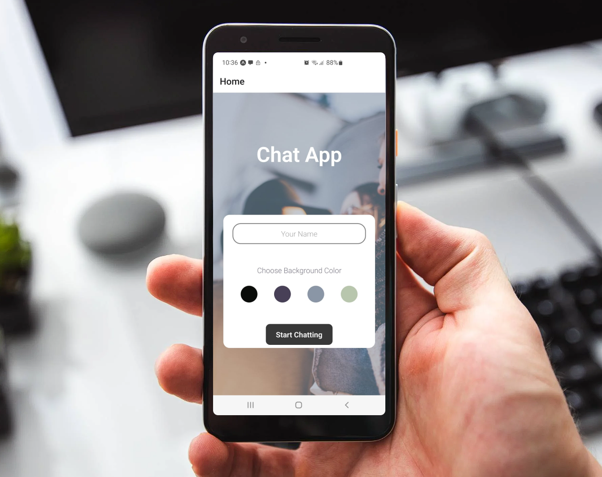

# Chat-App

Chat App is a mobile application using React Native. The app will provide users with a chat interface and options to share images and their location.

<!-- TABLE OF CONTENTS -->
<details>
  <summary>Table of Contents</summary>
  <ol>
    <li>
      <a href="#about-the-project">About The Project</a>
      <ul>
        <li><a href="#built-with">Built With</a></li>
      </ul>
    </li>
    <li>
      <a href="#getting-started">Getting Started</a>
      <ul>
        <li><a href="#prerequisites">Prerequisites</a></li>
        <li><a href="#installation">Installation</a></li>
      </ul>
      </li>
    <li><a href="#Dependencies">Dependencies</a></li>
  </ol>
</details>



<!-- ABOUT THE PROJECT -->

## About The Project

#### User Stories

- As a new user, I want to be able to easily enter a chat room so I can quickly start talking to my
  friends and family.
- As a user, I want to be able to send messages to my friends and family members to exchange
  the latest news.
- As a user, I want to send images to my friends to show them what I’m currently doing.
- As a user, I want to share my location with my friends to show them where I am.
- As a user, I want to be able to read my messages offline so I can reread conversations at any
  time.
- As a user with a visual impairment, I want to use a chat app that is compatible with a screen
  reader so that I can engage with a chat interface.

#### Key Features

- A page where users can enter their name and choose a background color for the chat screen
  before joining the chat.
- A page displaying the conversation, as well as an input field and submit button.
- The chat must provide users with two additional communication features: sending images
  and location data.
- Data gets stored online and offline.

<p align="right">(<a href="#top">back to top</a>)</p>

### Built With

#### Frameworks/libraries

- [React.js](https://reactjs.org/)
- [Expo](https://expo.dev/)

#### Database

- [Firebase Cloud Storage](https://firebase.google.com/)

<p align="right">(<a href="#top">back to top</a>)</p>

<!-- GETTING STARTED -->

## Getting Started

### Prerequisites

- npm
  ```sh
  npm install npm@latest -g
  ```
  - This command installs all the latest required dependencies.

### Installation

1.  Open your terminal and type

$ git clone {https://github.com/msemedo2/chat-app.git}

This clones the repo

2.  Install expo-cli

npm install --global expo-cli

### Launch Project

To launch the project you can use Xcode(Mac), Android Studio (Windows) OR your can install the expo app to your phone.

- App store link(Apple) => https://apps.apple.com/de/app/expo-go/id982107779
- Google play(Android) => https://play.google.com/store/apps/details?id=host.exp.exponent&hl=en_US&gl=US

- Using the command `expo start` will initialize the project

<p align="right">(<a href="#top">back to top</a>)</p>

<!-- DEPENDENCIES -->

## Dependencies

@react-native-async-storage/async-storage": "~1.15.0",

- "@expo/webpack-config": "^0.17.0",
- "@react-native-community/masked-view": "^0.1.11",
- "@react-navigation/native": "^6.0.12",
- "@react-navigation/stack": "^6.2.3",
- "expo": "~46.0.9",
- "expo-status-bar": "~1.4.0",
- "firebase": "^8.0.1",
- "react": "18.0.0",
- "react-dom": "18.0.0",
- "react-native": "0.69.5",
- "react-native-gesture-handler": "~2.5.0",
- "react-native-gifted-chat": "^1.0.4",
- "react-native-reanimated": "~2.9.1",
- "react-native-safe-area-context": "4.3.1",
- "react-native-screens": "~3.15.0",
- "react-native-web": "~0.18.7",
- "react-navigation": "^4.4.4",
- "@react-native-async-storage/async-storage": "~1.17.3",
- "@react-native-community/netinfo": "9.3.0",
- "expo-permissions": "~13.2.0",
- "expo-image-picker": "~13.3.1",
- "expo-location": "~14.3.0",
- "react-native-maps": "0.31.1"

<p align="right">(<a href="#top">back to top</a>)</p>
